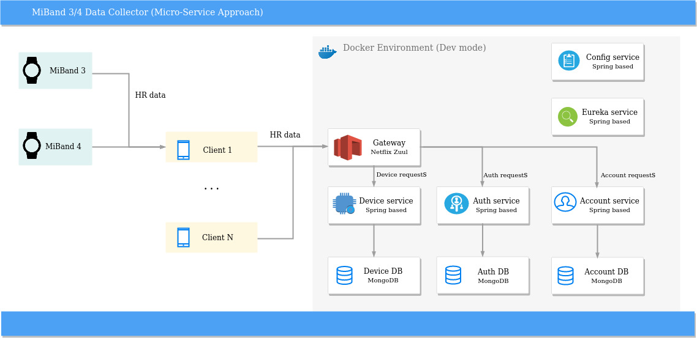

      

# SBP prototype 

**A server side for handling data from smart watches, bands**

SBP offers PoC of server side solution to work with data that comes from smart watches/bands.
Based on using of Java 11, Spring Boot, Spring Cloud and Docker. Micro-Service approach was chosen to implement
core functionality.

## Services review

Main components of SBP are described below on scheme:

SBP consists of two service groups:
1) business domain services (Account, Device)
2) technical services (Gateway, Auth, Config, Eureka, RabbitMq)

Additionally few MongoDB instances were integrate to provide data persistence.

## Account service
Contains user related logic including validation. Dev port: 6000

Method	| Path	| Description	| User authenticated	
------------- | ------------------------- | ------------- |:-------------:|
GET	| /accounts/{name}	| Get specified account by his name	|  | 	
POST	| /accounts/	| Register new account	|   | ×

#### Device service
Contains device related logic that is capable to register a new device, attach it to created account.
Last but not least it has rest end-points to handle device data and return already gathered data to client.
Default dev port: 7000

Method	| Path	| Description	| User authenticated
------------- | ------------------------- | ------------- |:-------------:|
GET	| /devices/{deviceId}	| Get device data by device id          | 	
POST	| /devices/	| persists a new device in db	|   
PUT	| /devices/	| modifies device's record by provided device json	|

